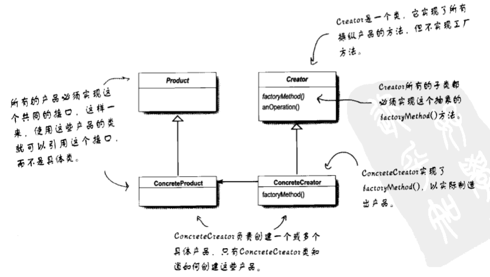
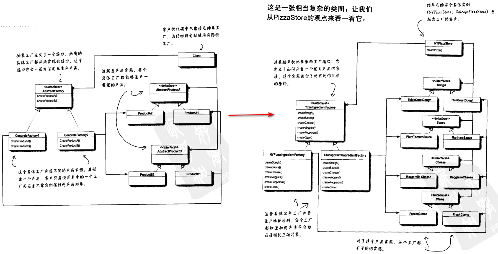
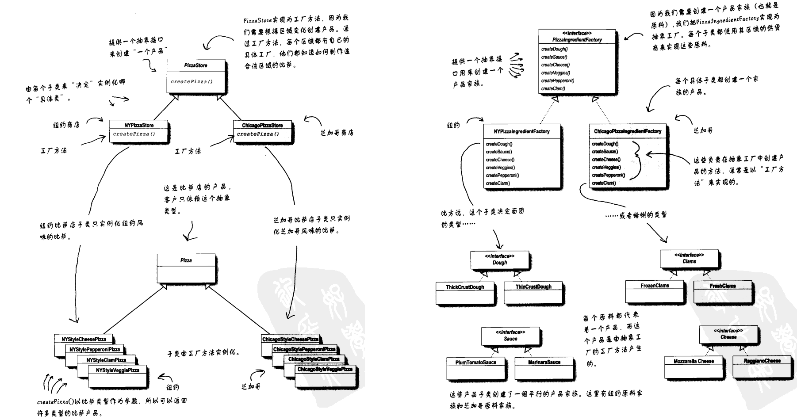

# Head First 设计模式

## Ch1 策略模式
OO基础：
- 抽象
- 封装
- 继承
- 多态

OO原则：
- 封装变化：
    将变化的部分取出并封装起来，以让其他部分不受影响。
- 多用组合，少用继承
- 针对接口编程，不针对实现编程

OO模式：
- 策略模式：
    定义算法族，分别封装起来，让它们之间可以互相替换，此模式让算法的变化独立于使用算法的用户。

## Ch2 观察者模式

## Ch3 装饰器模式

## Ch4 工厂模式
1. 简单工厂
    - [CODE](../ch4_工厂模式/1_SimpleFactory.cpp)

2. 工厂方法模式
    - [CODE](../ch4_工厂模式/2_FactoryMethod.cpp)
    
    - 总结
        - 定义了一个创建对象的接口，但由子类决定要实例化的类是哪一个。工厂方法让类把实例化推迟到子类。
        - 工厂方法让子类决定要实例化的类是哪一个。所谓的决定，并不是模式允许子类本身在运行时做决定，而是在编写创建者类时，不需要知道实际创建的产品是哪一个。选择了使用哪个子类，自然就决定了实际创建的产品是什么。

        

3. 总结
    - 产品的"实现"从"使用"中解耦。
    - 创建对象的代码封装起来，即，利用工厂封装实例化的行为：
        - 创建对象的代码集中封装在一个对象或方法中，可以避免代码的重复，方便维护。
        - 客户在实例化对象时，依赖于接口，而不是具体类。
        - 针对接口编程，而不是实现编程。
4. OO 设计原则
    - 依赖倒置原则 (Dependency Inversion Principle)
        - 要依赖抽象，而不是具体类
        - 不能让**高层组件**依赖低层组件，并且，不管高层还是低层组件，两者都应该依赖于抽象。
            - 高层组件：由其他低层组件定义其行为的类。如 PizzaStore 是一个高层组件，因为其行为由 Pizza 定义。PizzaStore 创建所有不同的 Pizza 对象，准备、切片等，而 Pizza 本身属于低层组件。
    - 避免在 OO 设计中违反依赖倒置原则（尽量达到该原则）
        - 变量不可以持有具体类的引用（使用工厂来避免 `new`）
        - 不让类派生自具体类（派生自一个接口）
        - 不要覆盖基类中已实现的方法（如果覆盖基类以实现的方法，那么基类就不是一个真正适合被继承的抽象。基类中已实现的方法应该由所有子类共享）
        
    - 如果一个类有可能改变，可以采用一些好技巧（如工厂）来封装改变

5. 抽象工厂模式
    - [CODE](../ch4_工厂模式/3_AbstractFactoryPattern.cpp)
    - 抽象工厂提供一个接口，用于创建相关或依赖对象的家族，而不需要明确指定具体类。
        
    - 抽象工厂的方法经常以工厂方法的方式实现。因为抽象工厂的任务是定义一个负责创建一组产品的接口。这个接口内的每个方法都负责创建一个具体产品，通过实现抽象工厂的子类来提供这些具体的做法。

6. 工厂方法和抽象工厂比较
    - 目标都是创建对象
    - 工厂方法通过**继承**来实现，所以利用工厂方法创建对象需要扩展一个类，并覆盖它的的工厂方法。
        - 通过子类来创建对象。
        - 只负责将客户从具体类型中解耦。  
    - 抽象工厂通过**对象的组合**来实现。
        - 提供一个用来创建一个产品家族的抽象类型，这个类型的子类定义了产品被产生的方法。
        - 将一群相关的产品组合起来。
        - 使用工厂方法来实现具体工厂，不同的具体工厂通过实现抽象工厂的工厂方法来创建各自的产品。
    - 当需要创建茶品家族和想让制造相关产品集合起来时，可以使用抽象工厂。
    - 工厂方法使用简单，只需继承为子类，并实现工厂方法即可。适用于将来不知道需要实例化哪些具体类。
        

7. 总结
    - 简单工厂：一种编程习惯，可以将客户端程序从具体类解耦。
    - 工厂方法使用继承，将对象创建任务委托给子类，子类实现工厂方法来创建对象。
        - 允许将类将实例化延迟到子类进行。
    - 抽象工厂使用对象的组合，对象的创建被实现在工厂接口所暴露出来的方法中。
        - 创建相关的对象嘉泽，而不依赖具体类。
    - **依赖倒置原则**：避免依赖具体类型，尽量依赖抽象
    - 工厂帮助我们面向抽象编程而不是面向具体类编程。