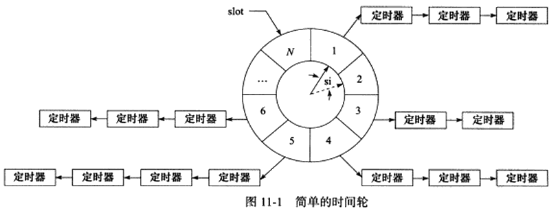

# 定时器
## 介绍 
定时事件是网络程序需要处理的第三类事件。比如定期检测一个客户连接的活动状态。
将每个定时事件分别封装为定时器，并使用某种容器类数据结构，比如链表、排序链表和时间轮，将所有的定时器串联起来，以实现对定时事件的统一管理。两种高效的管理定时器的容器：时间轮和时间堆。

定时即在一段时间之后触发某段代码的机制，可以在这段代码中依次处理所有到期的定时器。定时机制是定时器得以被处理的原动力。Linux 提供三种定时方法：
- socket 选项：SO_RCVTIMEO 和 SO_SNDTIMEO
- SIGALRM 信号
- I/O 复用系统调用的超时参数。
  
## socket 选项 SO_RCVTIMEO 和 SO_SNDTIMEO
SO_RCVTIMEO 和 SO_SNDTIMEO 分别用来设置 socket 接收和发送数据的超时时间。专用于 socket 相关的函数：send、sendmsg、recv、recvmsg、accept 和 connect。
| 系统调用 | 有效选项 | 系统调用超时后的行为 |
| ------- | ------- | ------- |
| send | SO_SNDTIMEO | return -1，errno = EAGAIN 或 EWOULDBLOCK |
| sendmsg | SO_SNDTIMEO | return -1，errno = EAGAIN 或 EWOULDBLOCK |
| recv | SO_RCVTIMEO | return -1，errno = EAGAIN 或 EWOULDBLOCK |
| recvmsg | SO_RCVTIMEO | return -1，errno = EAGAIN 或 EWOULDBLOCK |
| accept | SO_RCVTIMEO | return -1，errno = EAGAIN 或 EWOULDBLOCK |
| connect | SO_SNDTIMEO | return -1，errno = EINPROGRESS |

可以根据以上系统调用的返回值以及 errno 判断超时时间是否已到，进而决定是否开始处理定时任务。
[设置 connect 超时时间](./connect_timeout.cc) 中使用 SO_SNDTIMEO 选项来定时。

## SIGALRM 信号
由 alarm 和 setitimer 函数设置的实时闹钟一旦超时，将触发 SIGALRM 信号。因此，可以利用该信号的信号处理函数来处理定时任务。
SIGALRM 信号按照固定的频率生成，即由 alarm 和 setitimer 函数设置的定时周期 T 保持不变。如果某个定时任务的超时事件不是 T 的整数倍，那么它实际被执行的时间和预期的时间将略有偏差。因此，周期 T 反映了定时的精度。

处理非活动连接实例，介绍如何使用 SIGALRM 信号定时。该实例基于一种简单的定时器实现——升序链表的定时器。

### 基于升序链表的定时器
定时器通常至少包含两个成员：超时时间（相对时间或者绝对时间）和一个任务回调函数。使用链表作为容器来串联所有的定时器，则每个定时器还要包含指向下一个定时器的指针成员。若链表是双向的，则每个定时器还要包含一个前向的指针。

[升序定时器链表](./timer_list.h) 将其中的定时器按照超时时间做升序排序。

效率：添加定时器的时间复杂度为 O(n)，删除定时器为 O(1), 执行定时器任务时间复杂度为 O(1)。

基于[升序定时器链表](./timer_list.h) 的实际应用——[处理非活动连接](./nonactive_connection.cc)。

## I/O 复用系统调用的超时参数
Linux 下 3 组 I/O 复用系统调用都带有超时参数，因此它们不仅能统一处理信号和 I/O 事件，也能统一处理定时事件。由于 I/O 复用系统调用可能在超时事件到期之前就返回（有 I/O 事件发生），所以需要不断更新定时参数以反映剩余的时间。详见 [I/O复用的超时参数](./io_timeout.cc)。

## 高性能定时器
### 时间轮
基于排序链表的定时器存在一个问题：添加定时器的效率偏低。时间轮可以解决这个问题。一种简单的时间轮（只有一个轮子）如下图：

该时间轮内，实线指针指向轮子闪光的一个槽（slot），以恒定的速度顺时针转动，每转动一步就指向下一个槽（虚线指针指向的槽），每次转动称为一个滴答（tick）。一个滴答的时间称为时间轮的槽间隔 `si(slot interval)`，它实际上就是心搏时间。该时间轮共 N 个槽，因此转动一周的时间是 N * si。每个 slot 指向一条定时器链表，每条链表上的定时器的定时时间相差 `N*si` 的整数倍。时间轮利用这个性质将定时器散列到不同的链表中。

假设当前指针指向槽 cs，需要添加一个定时时间为 ti 的定时器，则该定时器将被插入槽 ts (timer solt) 对应的链表中：
$$ ts = (cs + (ti/si)) \% N $$

基于升序双向链表的定时器使用一条链表来管理所有定时器，所以插入操作的效率随着定时器数目的增多而降低。而时间轮使用哈希表的思想，将定时器散列到不同的链表上。这样每条链表上的定时器数目都将明显少于原来升序链表的定时器数量，插入操作的效率基本不受定时器数量的影响。

对于时间轮而言，si 越小，定时精度越高；而 N 越大，执行效率越高。复杂的时间轮可能有多个轮子，不同的轮子拥有不同的精度。相邻的两个轮子，精度高的转一圈，精度低的仅往前移动一槽。

[简单的时间轮代码实现](./time_wheel.h)。

对于时间轮而言，addTimer() 的时间复杂度是 O(1)，delTimer() 也是 O(1)，执行一个定时器的时间复杂度是 O(n)。实际上，执行一个定时器任务的效率要好于 O(n)，因为时间轮所有的定时器散列到了不同的链表上。时间轮的槽越多，等价于散列表的入口越多，从而每条链表上的定时器数量越少。当使用多个轮子来实现时间轮时，执行一个定时器任务的时间复杂度接近 O(1)。

### 时间堆
以上的升序链表定时器、时间轮都是以固定的频率调用心搏函数 tick()，并在其中依次检测到期的定时器，然后执行到期定时器上的回调函数。另外一种思路是：将所有的定时器中超时时间最小的一个定时器的超时值作为心搏间隔。这样，一旦心搏函数 tick 被调用，超时时间最小的定时器必然到期，就可以在 tick() 中处理该定时器。然后，再从剩余的定时器中找出超时时间最小的一个，并将这段最小时间设置为下一次心搏间隔，如此反复。

最小堆适合处理这种方案。最小堆是指每个节点的值都小于或等于其子节点的值的完全二叉树。

对于时间堆而言，addTimer() 的时间复杂度是 O(logn)，delTimer() 的时间复杂度为 O(1)，执行定时器的时间复杂度为 O(1)。

